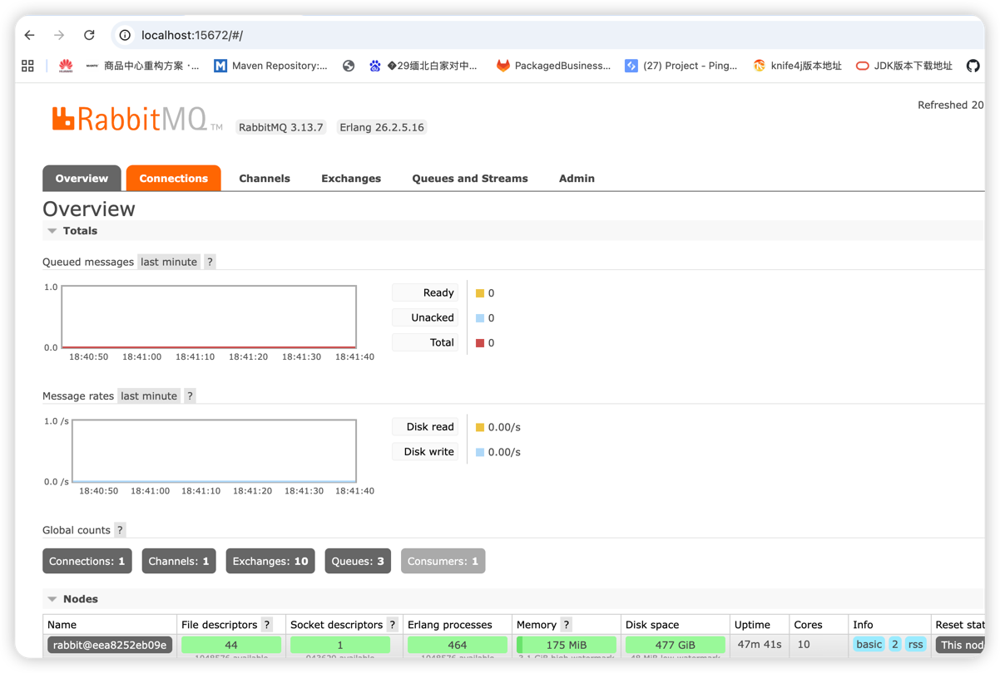
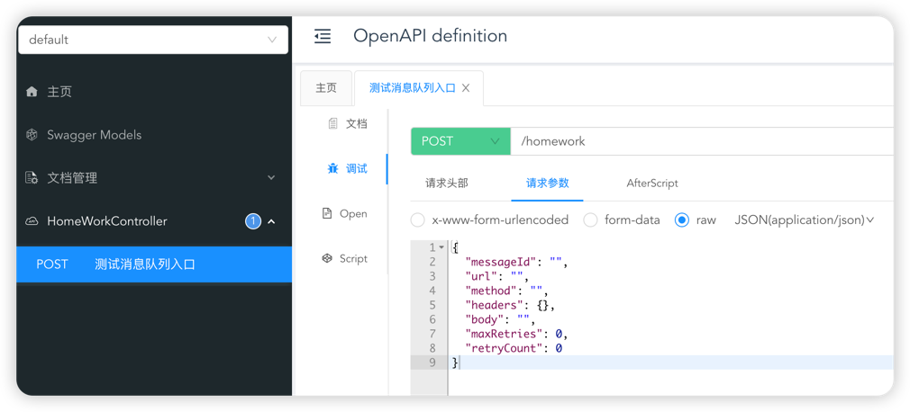

# rc_jinjiejie
# yy-data
作业
二、系统边界
2.1 本系统解决的问题
异步解耦：业务系统提交通知后立即返回，不阻塞业务流程。

可靠投递：通过持久化存储与重试机制，保证通知最终送达（或至少被系统记录）。

灵活适配：支持不同供应商的请求地址、Header、Body 格式，由业务系统在请求中提供完整的目标信息。

失败隔离：单个外部系统的故障不影响其他通知的处理。

可观测性：记录投递状态、失败原因，便于监控与排障。

2.2 本系统明确不解决的问题
业务幂等性：不保证通知的幂等性，由业务系统或供应商自行处理（例如通过业务 id 去重）。因为通知的重复可能源于网络超时后的重试，本服务无法判断业务上下文。

供应商 API 的版本兼容与格式转换：业务系统需自行构造符合供应商要求的完整请求。本服务只负责原样转发，不做协议转换或数据映射。

事务一致性：业务系统与本服务之间不提供分布式事务。业务系统需自行处理本地事务与通知提交之间的最终一致性（例如先提交本地事务，再发送通知；或通过本地消息表等模式）。

通知结果的业务处理：不根据外部 API 的返回值进行业务补偿，因为业务系统已明确不需要关心返回值。

原因：保持服务职责单一，避免引入与业务强相关的逻辑，降低复杂度与维护成本。

三、技术选型
组件	选型	理由	替代方案与取舍
开发框架	Spring Boot 3.x	成熟生态，快速构建 REST API 与集成中间件。	–
消息队列	RabbitMQ	原生支持 AMQP，提供持久化、确认机制、死信队列等特性，适合可靠投递场景。	Kafka：吞吐量更高但配置复杂，且对单条消息的可靠重试支持不如 RabbitMQ 原生； RocketMQ：同样强大但国内生态，若团队熟悉可替换。
数据库	PostgreSQL	可选用于记录通知日志、审计，但非核心路径。初期可依赖消息队列持久化。	MySQL 同样可用。若不需要审计，可完全依赖 MQ 持久化。
持久化存储	RabbitMQ 持久化队列	消息写入队列即落盘，配合 publisher confirm 确保消息不丢失。	不使用独立数据库可降低运维成本，适合第一版。
四、核心设计
┌─────────────┐     HTTP     ┌─────────────────────────────────────────────────────┐
│  业务系统   │ ───────────> │                 可靠通知服务                         │
└─────────────┘              │  ┌──────────────┐    ┌──────────────────────────┐   │
│  │  接收层 API  │───>│  消息队列（持久化）      │   │
│  └──────────────┘    │  - 待投递队列             │   │
│                       │  - 重试队列（带延迟）     │   │
│                       │  - 死信队列               │   │
│                       └────────────┬─────────────┘   │
│                                    │                 │
│                       ┌────────────▼─────────────┐   │
│                       │     投递消费者           │   │
│                       │   - 并发消费             │   │
│                       │   - 重试策略             │   │
│                       └────────────┬─────────────┘   │
│                                    │                 │
│                                    │ HTTP(S)         │
│                                    ▼                 │
│                          ┌─────────────────┐         │
│                          │  外部供应商 API  │         │
│                          └─────────────────┘         │
└─────────────────────────────────────────────────────┘
4.2 数据模型
通知消息结构（JSON）：

json
{
"messageId": "uuid",
"url": "https://api.supplier.com/endpoint",
"method": "POST",
"headers": {
"Content-Type": "application/json",
"Authorization": "Bearer xxx"
},
"body": "{ ... }",
"createdAt": "2025-01-01T00:00:00Z",
"retryCount": 0,
"maxRetries": 3
}
messageId：唯一标识，用于幂等（业务系统可自行生成并保证唯一性）。

其余字段完全由业务系统按供应商要求构造，服务不解析。

4.3 接收层 API
端点：POST /api/notify

请求体：上述 JSON 结构

处理流程：

校验必填字段（url、method 等）。
生成唯一 messageId（若业务系统未提供）。
将消息发送到 RabbitMQ 的待投递队列（pending.queue），使用 publisher confirm 确保消息成功写入队列。
立即返回 202 Accepted。
4.4 投递消费者
从 pending.queue 消费消息。

使用 RestClient（Spring 6.1+）或 WebClient 发起 HTTP 请求，设置合理的连接超时（如 5s）与读取超时（如 10s）。

投递结果处理：

成功（2xx）：消息确认（ACK），流程结束。

失败（非 2xx 或网络异常）：根据重试次数决定是否重试。

未达最大重试次数：将消息发送到重试队列（retry.queue），并设置延迟（如指数退避：1s, 2s, 4s...），同时 retryCount++。

已达最大重试次数：将消息发送到死信队列（dlq），记录失败原因，后续人工介入或定时扫描。

4.5 重试机制实现
RabbitMQ 原生支持延迟消息需插件（rabbitmq-delayed-message-exchange）或使用 TTL+死信队列。为简化第一版，采用 TTL + 死信队列 方式：

为每个重试级别创建临时队列，或使用单一重试队列配合 x-dead-letter-exchange 和 x-message-ttl。

更简单方案：使用 Spring Retry 结合 @Retryable 在消费者内重试，但会导致消费者阻塞。第一版可采用此方式，但会降低吞吐量。权衡后，使用外部重试队列更符合“可靠投递”设计，避免消费者线程长时间阻塞。

为简化实现，第一版可先用 Spring Retry 内置重试，配合手动 ACK，重试失败后发送到死信队列。后续流量增长再迁移至独立重试队列。

4.6 持久化保证
RabbitMQ 队列和消息均设置为持久化（durable=true，persistent=true）。

启用 publisher confirm，确保生产者发送的消息被 broker 持久化后才返回成功。

消费者使用手动 ACK，仅在投递成功或已转至死信队列时确认消息。

4.7 监控与告警
暴露 Micrometer 指标：待投递队列长度、死信队列长度、投递成功率、平均延迟等。

接入 Prometheus + Grafana 可视化。

死信队列堆积时触发告警，通知运维介入。

五、可靠性保证
5.1 投递语义：至少一次（At-least-once）
原因：在分布式系统中，网络超时或消费者重启可能导致消息被重复消费，但无法绝对避免。选择“至少一次”可保证不丢失通知，重复则由业务系统或供应商通过幂等处理（如基于 messageId 去重）。

5.2 消息不丢失链路
阶段	保证措施
业务系统 → 服务	HTTP 同步调用，服务收到后先持久化再返回 202，业务系统可重试失败请求
服务 → RabbitMQ	publisher confirm + 持久化消息
RabbitMQ 存储	持久化队列 + 镜像队列（集群模式）
RabbitMQ → 消费者	手动 ACK，投递成功后确认；异常时消息重新入队（或进入重试队列）
六、失败处理策略
6.1 临时性失败
网络超时、供应商返回 5xx 等：自动重试，采用指数退避（初始 1s，最大 60s），最多 3 次。

重试次数可配置（按供应商维度或全局）。

6.2 长期不可用
达到最大重试次数后，消息进入死信队列。

运维人员通过管理界面查看死信消息，分析原因（例如供应商 URL 已变更、认证过期等）。

提供管理 API 或后台界面，允许手动重试或修改消息后重新投递。

6.3 业务系统主动干预
业务系统可通过 messageId 查询投递状态（可选功能）。

若供应商通知地址变更，可通过管理工具批量修改死信队列中的 URL（需扩展）。

七、演进与过度设计分析
7.1 AI 方案中“过度设计”的取舍
在评估 AI 可能给出的建议时，以下设计被认为是过度的，第一版不会采纳：

引入分布式事务（如 SAGA）：业务系统已明确不需要根据返回结果进行补偿，且本服务职责单一，无需保证跨系统一致性。

复杂的规则引擎：用于根据供应商不同执行不同的重试策略或格式转换。初期所有供应商统一重试策略即可，格式转换由业务系统负责。

独立数据库存储全部通知日志：消息队列已持久化消息，除非需要长期审计或复杂查询，否则增加运维负担。第一版可不引入数据库，仅依赖 MQ 的持久化与死信队列。

多级缓存：通知服务无状态，无需缓存。

全链路压测与弹性伸缩：第一版按单机部署，使用 Spring Boot 内置线程池处理 HTTP 请求，消费者并发数可控。流量增长时再水平扩展。

判断依据：YAGNI 原则，先解决核心需求（可靠投递），保持简单，后续根据实际瓶颈迭代。

7.2 第一版到高流量演进
当未来流量或复杂度显著增长时，可逐步演进：

水平扩展：服务无状态，可多实例部署，RabbitMQ 采用集群。

数据库引入：将投递记录写入 PostgreSQL，便于审计、查询、死信管理可视化。

精细化重试策略：按供应商配置重试次数、延迟策略，使用 RabbitMQ 延迟交换器（插件）实现灵活延迟。

消费能力提升：增加消费者并发数，或改用 Kafka 以提升吞吐（若投递量达到万级 TPS）。

死信管理自动化：开发管理后台，支持消息编辑、重试、死信告警与自动处理（如定期重试过期的死信）。

安全增强：添加鉴权（API Key）、限流（基于 Redis 的令牌桶）防止业务系统滥用

2.7 消费者（核心重试逻辑）
消费者监听 pending.queue，尝试投递。如果失败且未达最大重试次数，则将消息发送到 retry.exchange 并设置 TTL（延迟）；如果达到最大重试次数，则发送到死信交换机。

java
package com.example.notify.consumer;

import com.example.notify.config.RabbitMQConfig;
import com.example.notify.exception.DeliveryException;
import com.example.notify.model.NotificationRequest;
import com.example.notify.service.HttpDeliveryService;
import com.rabbitmq.client.Channel;
import lombok.extern.slf4j.Slf4j;
import org.springframework.amqp.core.Message;
import org.springframework.amqp.rabbit.annotation.RabbitListener;
import org.springframework.amqp.rabbit.core.RabbitTemplate;
import org.springframework.amqp.support.AmqpHeaders;
import org.springframework.beans.factory.annotation.Autowired;
import org.springframework.messaging.handler.annotation.Header;
import org.springframework.stereotype.Component;

import java.io.IOException;
import java.time.Instant;
import java.util.HashMap;
import java.util.Map;
import java.util.concurrent.TimeUnit;

@Slf4j
@Component
public class NotificationConsumer {

    @Autowired
    private HttpDeliveryService httpDeliveryService;

    @Autowired
    private RabbitTemplate rabbitTemplate;

    /**
     * 从主队列消费消息，进行投递
     */
    @RabbitListener(queues = RabbitMQConfig.PENDING_QUEUE, containerFactory = "rabbitListenerContainerFactory")
    public void consume(NotificationRequest request, Channel channel,
                        @Header(AmqpHeaders.DELIVERY_TAG) long deliveryTag) throws IOException {
        log.info("收到消息: messageId={}, retryCount={}", request.getMessageId(), request.getRetryCount());
        try {
            httpDeliveryService.deliver(request);
            // 投递成功，手动 ACK
            channel.basicAck(deliveryTag, false);
        } catch (DeliveryException e) {
            log.warn("投递失败: messageId={}, error={}", request.getMessageId(), e.getMessage());
            // 判断是否需要重试
            int currentRetry = request.getRetryCount();
            if (currentRetry < request.getMaxRetries()) {
                // 增加重试次数
                request.setRetryCount(currentRetry + 1);
                // 计算延迟时间：指数退避，例如 1s, 2s, 4s...
                long delayMillis = (long) Math.pow(2, currentRetry) * 1000;
                // 发送到重试交换机，并设置 TTL
                sendToRetryExchange(request, delayMillis);
                // 确认原消息（已被消费，不需要再保留）
                channel.basicAck(deliveryTag, false);
                log.info("消息进入重试队列: messageId={}, retryCount={}, delay={}ms",
                        request.getMessageId(), request.getRetryCount(), delayMillis);
            } else {
                // 超过最大重试次数，发送到死信队列（直接 NACK 并让其进入死信？或者手动发到死信交换机）
                // 我们选择直接发送到死信交换机，然后 ACK 原消息
                sendToDeadLetter(request, e.getMessage());
                channel.basicAck(deliveryTag, false);
                log.error("消息最终失败，已进入死信队列: messageId={}", request.getMessageId());
            }
        } catch (Exception ex) {
            // 其他异常（如序列化），记录并拒绝消息，不重试（避免无限循环）
            log.error("消费异常，拒绝消息: messageId={}", request.getMessageId(), ex);
            channel.basicReject(deliveryTag, false); // 不重新入队
        }
    }

    /**
     * 发送到重试交换机，带 TTL 延迟
     */
    private void sendToRetryExchange(NotificationRequest request, long delayMillis) {
        // 注意：RabbitMQ 的延迟消息需要队列或消息级别的 TTL，这里使用消息级别的 TTL
        // 创建消息属性，设置 expiration（毫秒）
        Message message = rabbitTemplate.getMessageConverter().toMessage(request, null);
        message.getMessageProperties().setExpiration(String.valueOf(delayMillis));
        // 发送到重试交换机，路由键为 retry
        rabbitTemplate.send(RabbitMQConfig.RETRY_EXCHANGE, RabbitMQConfig.RETRY_ROUTING_KEY, message);
    }

    /**
     * 发送到死信队列（可以直接使用死信交换机）
     */
    private void sendToDeadLetter(NotificationRequest request, String reason) {
        Map<String, Object> headers = new HashMap<>();
        headers.put("failureReason", reason);
        headers.put("failedAt", Instant.now().toString());
        Message message = rabbitTemplate.getMessageConverter().toMessage(request, null);
        message.getMessageProperties().setHeaders(headers);
        rabbitTemplate.send(RabbitMQConfig.DLX_EXCHANGE, RabbitMQConfig.DLX_ROUTING_KEY, message);
    }
}
说明：上面的 sendToRetryExchange 使用了消息级别的 TTL。消息发送到 retry.exchange 后，根据绑定会被路由到 retry.queue，但由于设置了 TTL，消息会在队列中等待到期后才被消费者获取。这种机制无需安装延迟插件。

注意：RabbitMQ 的 TTL 是以消息入队时间开始计算的，如果多个消息 TTL 不同，会阻塞队列，但重试场景下每个消息独立，可以接受。更精确的延迟可使用插件，但此处足够。

2.8 重试队列的消费者
需要单独一个消费者监听 retry.queue，逻辑与主消费者相同：尝试投递，成功则 ACK，失败则根据重试次数决定继续重试（再次进入重试队列）或进入死信。为了避免代码重复，我们可以让 retry.queue 的消费者直接调用同一个 consume 方法吗？不行，因为 consume 已经绑定到主队列。我们需要创建一个新的方法监听重试队列，但逻辑几乎一样。我们可以抽取公共投递逻辑到一个方法中。

修改消费者类，新增一个监听重试队列的方法，复用投递逻辑：

java
/**
* 从重试队列消费消息
  */
  @RabbitListener(queues = RabbitMQConfig.RETRY_QUEUE, containerFactory = "rabbitListenerContainerFactory")
  public void retryConsume(NotificationRequest request, Channel channel,
  @Header(AmqpHeaders.DELIVERY_TAG) long deliveryTag) throws IOException {
  // 与主队列消费逻辑完全一样，直接调用统一处理方法
  processDelivery(request, channel, deliveryTag);
  }

  /**
    * 统一投递处理
      */
      private void processDelivery(NotificationRequest request, Channel channel, long deliveryTag) throws IOException {
      log.info("处理投递: messageId={}, retryCount={}", request.getMessageId(), request.getRetryCount());
      try {
      httpDeliveryService.deliver(request);
      channel.basicAck(deliveryTag, false);
      } catch (DeliveryException e) {
      log.warn("投递失败: messageId={}, error={}", request.getMessageId(), e.getMessage());
      int currentRetry = request.getRetryCount();
      if (currentRetry < request.getMaxRetries()) {
      request.setRetryCount(currentRetry + 1);
      long delayMillis = (long) Math.pow(2, currentRetry) * 1000;
      sendToRetryExchange(request, delayMillis);
      channel.basicAck(deliveryTag, false);
      } else {
      sendToDeadLetter(request, e.getMessage());
      channel.basicAck(deliveryTag, false);
      }
      } catch (Exception ex) {
      log.error("消费异常，拒绝消息: messageId={}", request.getMessageId(), ex);
      channel.basicReject(deliveryTag, false);
      }
      }
      然后将原来的 consume 方法改为调用 processDelivery：

java
@RabbitListener(queues = RabbitMQConfig.PENDING_QUEUE, containerFactory = "rabbitListenerContainerFactory")
public void consume(NotificationRequest request, Channel channel,
@Header(AmqpHeaders.DELIVERY_TAG) long deliveryTag) throws IOException {
processDelivery(request, channel, deliveryTag);
}

说明：
本地需要安装rabbitmq-delayed-message-exchange插件，才能使用延迟消息功能。或者使用TTL+死信队列的方式实现重试延迟。
Rabbitmq截图

访问地址：
http://localhost:9000/doc.html#/default/HomeWorkController/notify
